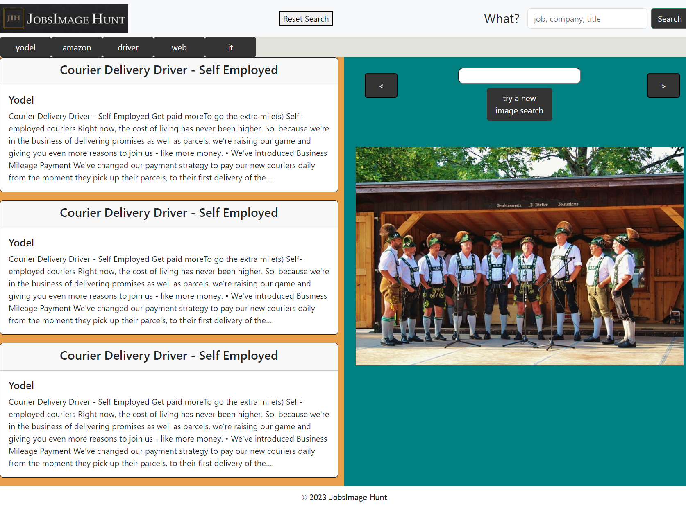

# JobsImage Hunt

## Description

This repo contains an interactive application that can be used to search for both jobs and images. It uses two server-side APIs: one from https://developer.adzuna.com/ and another from https://pixabay.com/. This allows a user to search for job vacancies and images that are both related and unrelated to the role. 

Skills used include html, css, javascript, web APIs, functions, fetch, event listeners, local storage and math.  
 

## Issues

1. The description of the job search API results are incomplete. Therefore, sentences may appear to end abruptly with "..." at the end.
2. The job search API has a slower response, so expect a slight delay between clicking search and receiving results.   
 
## Instructions

1. The application can be accessed by following this link: https://andrewowstyles.github.io/Project-one/. Please see below for instructions and screenshots.

2. Once the webpage has opened, click into the search box (_top right of the window_) and type in your preferred search term (_job type, company name or job title_), then press the **Enter** key or use the mouse to click the **Search** button.

3. **Job search results** will be displayed on the **left** with a corresponding **image** on the **right**. These results are **limited to 3 for job searches and one for image searches**. Images can be **changed** by using the **buttons to the left and right** of displayed image. The image representation of the application can be seen in the screenshot below.
 
 

 
 
4. Further searches can be performed in the following ways: 
a. Repeat step 2. 
b. Image only - click in the search box above the displayed image, type the search term and click the **"try a new image search"** button. 
c. Historical - every search completed by following step 2, creates a history button below the logo. Clicking on any one of these buttons will result in a new search being completed. Job results are randomised so this may yield different results to the previous search.
 
5. The "**Reset Search**" button (_between the logo and search box_) will clear the search history and remove the buttons below the logo.
 

## Credits

Materials used to facilitate the learning experience can be found via the links below:
- https://git-scm.com/book/en/v2/Git-Branching-Basic-Branching-and-Merging
- https://developer.adzuna.com/overview
- https://stackoverflow.com/questions/1527803/generating-random-whole-numbers-in-javascript-in-a-specific-range
- https://www.geeksforgeeks.org/how-to-clear-the-content-of-a-div-using-javascript/
- https://developer.mozilla.org/en-US/docs/Web/API/setTimeout
- https://developer.mozilla.org/en-US/docs/Web/CSS/visibility
- https://developer.mozilla.org/en-US/docs/Web/API/Window/localStorage

## Licence

Licensed under the [MIT]()

